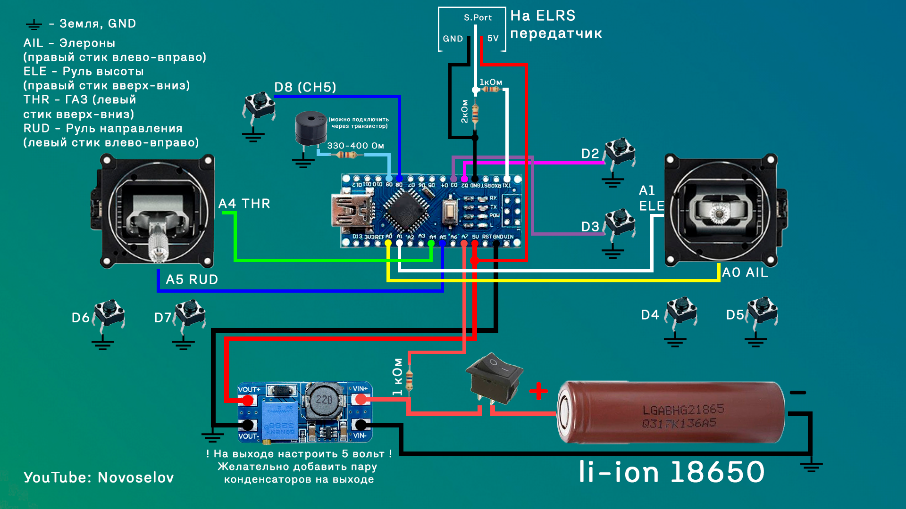
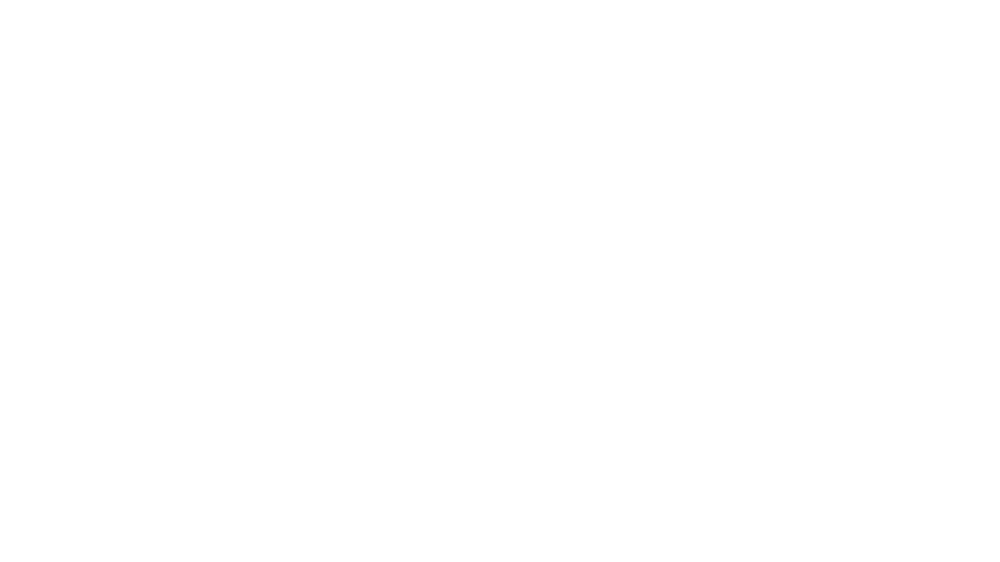
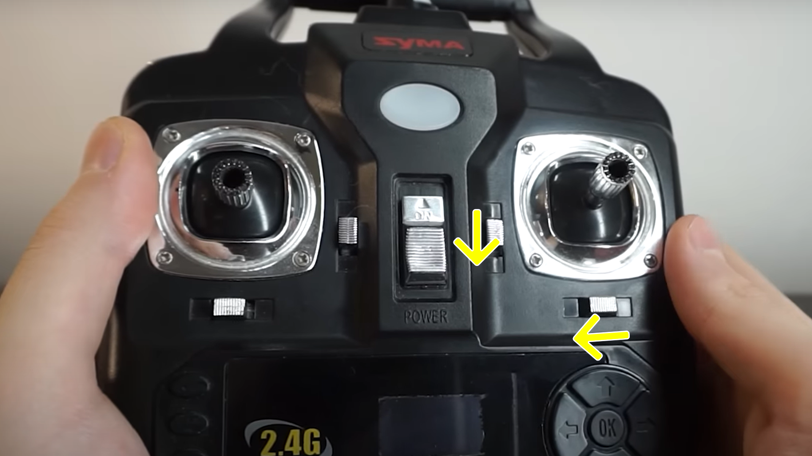
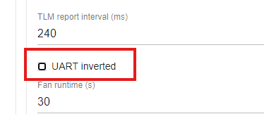

# Arduino-ELRS-Controller

* [Описание проекта](#описание)  
* [Схемы](#схемы)  
  * [Схема аппаратуры управления](#схема-аппаратуры-управления-без-передающего-модуля-elrs) 
  * [Схема передатчика ELRS](#схема-передатчика-elrs-tx-900mhz)
  * [Схема приемника ELRS](#схема-приемника-elrs-rx-pwm4-900mhz)
* [Антенны](#антенны)
* [Калибровка стиков](#калибровка-стиков)
* [Управление мощностью и скоростью передачи пакетов](#управление-мощностью-и-скоростью-передачи-пакетов)
* [Ссылки на комплектующие](#ссылки-на-комплектующие)

## Описание
Проект "Arduino ELRS controller" предназначен для создания аппаратуры управления на базе Arduino в связке с модулями ExpressLRS как самодельными, так и с заводскими. Реализовать этот проект можно на любой компонентной базе. Видео по сборке этого проекта можно посмотреть на YouTube "[ДАЛЬНОБОЙНАЯ ARDUINO аппаратура управления || ExpressLRS](https://youtu.be/eXaWpuBfFW8?si=YdgBgIKVBinbROiB)"

Общение с ELRS модулем построенно на базе проекта "[Simple TX](https://github.com/kkbin505/Arduino-Transmitter-for-ELRS)"
## Схемы
### Схема аппаратуры управления (без передающего модуля ELRS).

 Дополнительно для зарядки и защиты аккумулятора можно поставить плату tp4056 - https://clck.ru/38apD2

___
### Схема передатчика ELRS TX 900MHz
Ссылка на проект в EasyEDA - "[ELRS TX](https://oshwlab.com/redbanannas/elrs_tx)"

___

### Схема приемника ELRS RX PWM4 900MHz
Ссылка на проект в EasyEDA - "[ELRS RX](https://oshwlab.com/redbanannas/elrs_rx)"

# Антенны
 Лучше купить готовые антенны, например вот [тут](https://clck.ru/38auKu) или [тут](https://clck.ru/38auNj), но можно и сделать их самостоятельно. 
## Размеры антенн

* Коаксиальный кабель 1.37mm - https://clck.ru/38aom3
* i-pex(U.fl) "хвосты" 
(IPEX1, 10СМ) - https://clck.ru/38ap5t
___
# Калибровка стиков
Для старта калибровки стиков необходимо перед включением аппаратуры зажать триммер руля высоты вниз и триммер элеронов влево, после этого включить аппаратуру.

После характерного писка аппаратуры можно начинать калибровку стиков строго по порядку:
1. Правый стик(AIL) ВПРАВО до упора, после ВЛЕВО до упора. Дожидаемся одиночного сигнала от аппаратуры
2. Правый стик(ELE) ВВЕРХ до упора, после ВНИЗ до упора. Дожидаемся одиночного сигнала от аппаратуры
3. Левый стик(THR) ВВЕРХ до упора, после ВНИЗ до упора. Дожидаемся одиночного сигнала от аппаратуры
4. Левый стик(RUD) ВПРАВО до упора, после ВЛЕВО до упора. 

Дожидаемся подтверждающего радостного двойного сигнала аппаратуры. Все, калибровка завершена успешно!)

# Управление мощностью и скоростью передачи пакетов
Управлять мощностью передатчика и скоростью передачи пакетов можно с помощью стиков. Для этого необходимо при включении отклонить соответствующий стик в крайнее положение.
  
  Управление мощностью:
* Левый стик влево (RUD) - 25 mW 
 * Левый стик вправо (RUD) - 50 mW

Управление скоростью передачи пакетов:
 * Правый стик влево (AIL) - 25 Hz
* Правый стик вправо (AIL) - 50 Hz
* Правый стик вниз (ELE) - 100 Hz
* Правый стик вверх (ELE) - 200 Hz

__С версии 3.3.0 перестал работать неинвертированный UART, поэтому настройки могут не изменяться. Необходимо прошить передатчик на версию 3.3.0 и через веб-интерфейс (Wi-Fi) убрать галочку "uart inverted".__  Приемники с версией прошивки 3.x.x будут без проблем подключаться к передатчику с версией 3.3.0

# Прошивка ELRS 
Прошиваются ESP модули с помощю USB TTL [конвертора](https://clck.ru/38auqK). Подключается TX от ESP в RX программатора, а TX в RX соответственно. 

ELRS можно прошивать с помощью программы [ExpressLRS Configurator](https://github.com/ExpressLRS/ExpressLRS-Configurator/releases)
 ## Передатчик ELRS
 * Категория устройства - **DIY devices 900 MHz**
 * Устройство - **DIY TTGO V2 900MHz RX**
 
 В версиях выше 3.3.0 не работает неинвертированный UART, поэтому управление мощностью и скоростью передачи пакетов с помощью стиков не будет работать.
  
  ## Приемник ELRS
 * Категория устройства - **Generic targets used as a base 900 MHz**
 * Устройство - **Generic ESP8285 SX127x with PWM 900MHz RX**
 
В последней версии ELRS конфигуратора убрали возможность выбора Generic таргетов, поэтому можно выбрать следующий таргет:
 * Категория устройства - **Happymodel 900 MHz**
 * Устройство - **HappyModel EPW6 PWM RX**

# Ссылки на комплектующие

## Ардуино контроллер

* arduino nano - https://clck.ru/38aofY
* Повышающий преобразователь mt3608 - https://clck.ru/38aqLv
* Пассивная пищалка - https://clck.ru/38arpu  
 Для сборки контроллера также необходимы два джойстика(гимбала) и несколько кнопок ([см. схему](#arduino-elrs-controller)) 
 ### Пищалку можно подключить через транзистор.
 Будет громче работать:) Подойдет NPN транзистор 2n3904   
 
 
____

## ELRS Передатчик
* ESP32-WROOM-32D - https://clck.ru/38aqnJ
* LoRa модуль Ra-01 - https://clck.ru/38aqyS (другой 2шт в комплекте - https://clck.ru/38ar5W **!РАЗЛИЧАЮТСЯ РАСПИНОВКОЙ!** Подойдет только для сборки навесным монтажем или придется переделывать плату)
* Понижающий преобразователь - https://clck.ru/38asGB
* Резистор 10кОм 1206 - https://clck.ru/38atJ5
* Керамический конденсатор 2.2u 1206 - https://clck.ru/38au4c (поштучно на али не найти, поэтому рекомендую поискать в местных магазинах конденсатор 1206 с емкостью 1-5uF )
* Антенный разъем i-pex - https://clck.ru/38asWF
* Антенна на 900MHz - https://clck.ru/38auKu или https://clck.ru/38auLi или длинее https://clck.ru/38auNj
* Контактный разъем 2.54 - https://clck.ru/38avgH
___

## ELRS Приемник
* ESP-01F - https://clck.ru/38arNG
* LoRa модуль Ra-01(SX1276) - https://clck.ru/38aqyS (другой 2шт в комплекте - https://clck.ru/38ar5W **!РАЗЛИЧАЮТСЯ РАСПИНОВКОЙ!** Подойдет только для сборки навесным монтажем или придется переделывать плату)
* Понижающий преобразователь AMS1117 3.3 - https://clck.ru/38ataB
* Резистор 220Ом 1206 - https://clck.ru/38atJ5
* Светодиод 1206 - https://clck.ru/38b66K 100шт!? Цвет любой.
* Керамический онденсатор 2.2u 1206 - https://clck.ru/38au4c
* Электролитический конденсатор 100u 16v - https://clck.ru/38b3pb 50 штук?! проще в местных магазинах найти или отпаять от какой-нибудь платы :)
* Антенный разъем i-pex - https://clck.ru/38asWF
* Антенна на 900MHz - https://clck.ru/38auKu или https://clck.ru/38auLi или длинее https://clck.ru/38auNj
* Контактный разъем 2.54 - https://clck.ru/38avgH

