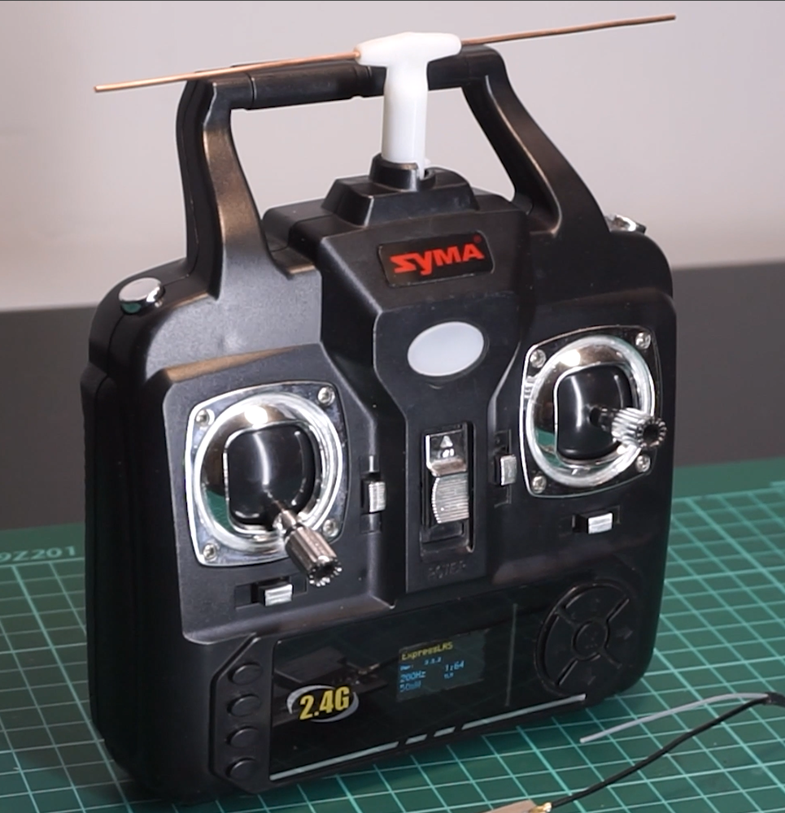

# Arduino-ELRS-Controller
## **/Страница редактируется/**

Проект "Arduino ELRS controller" предназнчен для создания аппаратуры управления на базе Arduino в связке с модулями ExpressLRS как самодельными, так и с заводскими. Реализовать этот проект можно на любой компонентной базе.
Общение с ELRS модулем построенно на базе проекта "[Simple TX](https://github.com/kkbin505/Arduino-Transmitter-for-ELRS)"
