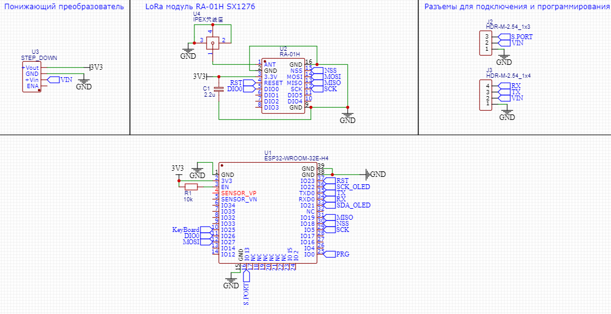
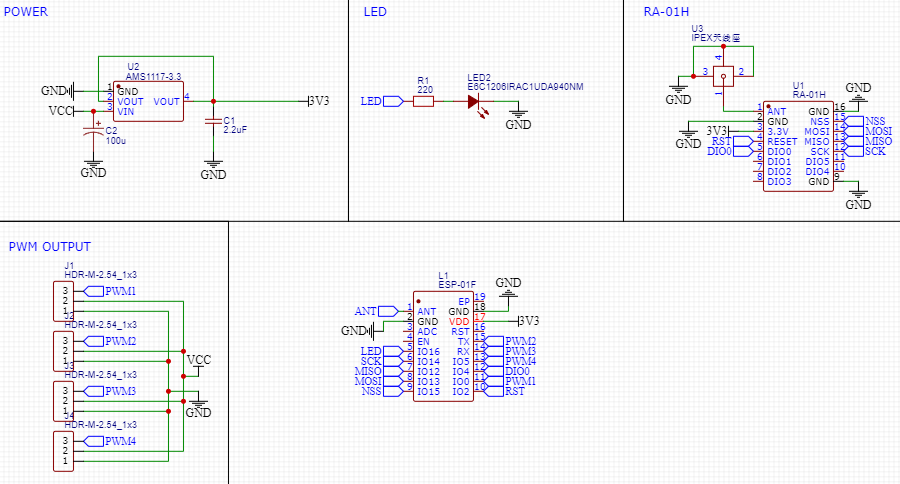

# Arduino-ELRS-Controller

## Описание
Проект "Arduino ELRS controller" предназнчен для создания аппаратуры управления на базе Arduino в связке с модулями ExpressLRS как самодельными, так и с заводскими. Реализовать этот проект можно на любой компонентной базе. Видео по сборке этого проекта можно посмотреть на YT "[ДАЛЬНОБОЙНАЯ ARDUINO аппаратура управления || ExpressLRS](https://github.com/kkbin505/Arduino-Transmitter-for-ELRS)"

Общение с ELRS модулем построенно на базе проекта "[Simple TX](https://github.com/kkbin505/Arduino-Transmitter-for-ELRS)"
## Схемы
Схема аппаратуры управления (без передающего модуля ELRS). Дополнительно для зарядки и защиты аккумулятора можно поставить плату tp5056 - https://clck.ru/38apD2

### Схема передатчика ELRS TX 900MHz
Ссылка на проект в EasyEDA - "[ELRS TX](https://oshwlab.com/redbanannas/elrs_tx)"

### Схема приемника ELRS RX PWM4 900MHz
Ссылка на проект в EasyEDA - "[ELRS RX](https://oshwlab.com/redbanannas/elrs_rx)"

# Антенны
 Лучше купить готовые антенны, например вот [тут](https://clck.ru/38auKu) или [тут](https://clck.ru/38auNj), но можно и сделать их самостоятельно. Работать будут скорее всего хуже покупных, если у Вас нет специальных приборов для замеров характеристик антенн.
## Размеры антенн

* Коаксиальный кабель 1.37mm - https://clck.ru/38aom3
* i-pex(U.fl) "хвосты" 
(IPEX1, 10СМ) - https://clck.ru/38ap5t

# Ссылки на комплектующие

## Ардуино контроллер

* arduino nano - https://clck.ru/38aofY
* Повышающий преобразователь mt3608 - https://clck.ru/38aqLv
* Пассивная пищалка - https://clck.ru/38arpu

 Для его сборки также необходимы два джойстика(гимбала) и несколько кнопок (см. схему) 

## ELRS Передатчик
* ESP32-WROOM-32D - https://clck.ru/38aqnJ
* LoRa модуль Ra-01 - https://clck.ru/38aqyS (другой 2шт в комплекте - https://clck.ru/38ar5W **!РАЗЛИЧАЮТСЯ РАСПИНОВКОЙ!** Подойдет только для сборки навесным монтажем или придется переделывать плату)
* Понижающий преобразователь - https://clck.ru/38asGB
* Резистор 10кОм 1206 - https://clck.ru/38atJ5
* Конденсатор 2.2u 1206 - https://clck.ru/38au4c (поштучно на али не найти, поэтому рекомендую поискать в местных магазинах конденсатор 1206 с емкостью 1-5uF )
* Антенный разъем i-pex - https://clck.ru/38asWF
* Антенна на 900MHz - https://clck.ru/38auKu или https://clck.ru/38auLi или длинее https://clck.ru/38auNj
* Контактный разъем 2.54 - https://clck.ru/38avgH

## ELRS Приемник
* ESP-01F - https://clck.ru/38arNG
* LoRa модуль Ra-01(SX1276) - https://clck.ru/38aqyS (другой 2шт в комплекте - https://clck.ru/38ar5W **!РАЗЛИЧАЮТСЯ РАСПИНОВКОЙ!** Подойдет только для сборки навесным монтажем или придется переделывать плату)
* Понижающий преобразователь AMS1117 3.3 - https://clck.ru/38ataB
* Резистор 220Ом 1206 - https://clck.ru/38atJ5
* Конденсатор 2.2u 1206 - https://clck.ru/38au4c
* Антенный разъем i-pex - https://clck.ru/38asWF
* Антенна на 900MHz - https://clck.ru/38auKu или https://clck.ru/38auLi или длинее https://clck.ru/38auNj
* Контактный разъем 2.54 - https://clck.ru/38avgH

# Прошивка ELRS 
Прошиваются ESP модули с помощю USB TTL [конвертора](https://clck.ru/38auqK). Подключается TX от ESP в RX программатора, а TX в RX соответственно. 

ELRS можно прошивать с помощью программы [ExpressLRS Configurator](https://github.com/ExpressLRS/ExpressLRS-Configurator/releases)
 ## Передатчик ELRS
 * Категория устройства - **DIY devices 900 MHz**
 * Устройство - **DIY TTGO V2 900MHz RX**
  
  ## Приемник ELRS
 * Категория устройства - **Generic targets used as a base 900 MHz**
 * Устройство - **Generic ESP8285 SX127x with PWM 900MHz RX**